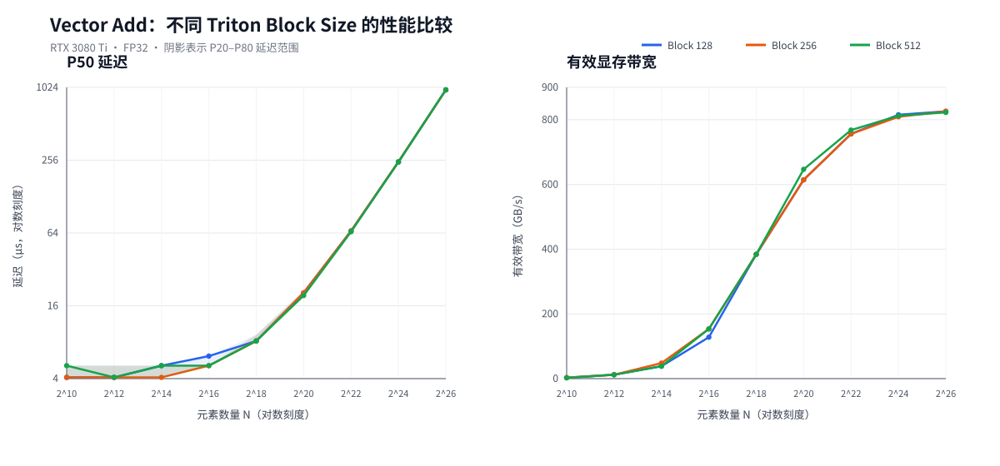

# LLM Kernel Lab

> 使用 PyTorch、Triton 和 CUDA 实现、分析并优化大语言模型核心算子。
>
> A hands-on laboratory for implementing, profiling, and optimizing LLM
> operators with PyTorch, Triton, and CUDA.

项目采用统一的研究流程：

```text
PyTorch 参考实现 → Triton Kernel → 正确性测试 → 性能基准 → 瓶颈分析
```

本项目优先关注学习、正确性、性能分析和硬件原理，不以成为生产级算子库为目标。

## 当前里程碑

目前只研究 Phase 0 的 Vector Add。只有当前算子拥有正确实现、可复现的 Benchmark
以及完整的性能解释后，才会进入下一个算子。

| 算子 | PyTorch | Triton | CUDA | 研究重点 |
|---|---:|---:|---:|---|
| Vector Add | ✓ | ✓ | 计划中 | 显存带宽 |

## 当前关键结果

RTX 3080 Ti 上的大尺寸 FP32 Vector Add：

- 独立 Benchmark 有效带宽约为 809～826 GB/s；
- Nsight Compute 测得 DRAM Throughput 为 91.67%；
- Compute (SM) Throughput 为 7.53%；
- PyTorch 与 Triton 在大尺寸下性能基本相同。

这些数据共同证明当前 Vector Add 是显存带宽受限，而不是计算能力受限。完整分析见
[Nsight Compute 实验报告](benchmarks/results/vector_add_rtx3080ti_ncu_basic.md)。



三种 Block Size 在大尺寸下都进入约 810～826 GB/s 的带宽平台。它们之间的差异很小，
不足以支持某个 Block Size 显著更快的结论。

## 已验证的开发环境

- Windows 11、Python 3.11.9
- NVIDIA GeForce RTX 3080 Ti（12 GB，计算能力 8.6）
- NVIDIA 驱动 591.86
- CUDA Toolkit 12.6
- PyTorch 2.14.0+cu126
- triton-windows 3.8.0.post28
- Visual Studio Build Tools 2022 / MSVC 19.44

编译器和 Git 发布环境的详细情况见[开发环境检查](docs/environment.md)。

## 运行第一个实验

```powershell
python llm_kernels/vector_add/test.py
python llm_kernels/vector_add/benchmark.py
```

完成正确性和 Benchmark 后，可以用 Nsight Compute 捕获一次预热后的 Kernel：

```powershell
ncu --set basic --kernel-name regex:vector_add_kernel --launch-skip 10 `
    --launch-count 1 python llm_kernels/vector_add/profile.py
```

Benchmark 会输出延迟和有效带宽。对于包含 `N` 个 FP32 元素的向量，理论上的最低
全局显存流量为：

```text
读取 x + 读取 y + 写入 output = 12N 字节
```

## 当前目录结构

```text
llm-kernel-lab/
├── README.md
├── LICENSE
├── pyproject.toml
├── requirements.txt
├── scripts/
│   └── plot_vector_add.py
├── benchmarks/
│   └── results/
├── docs/
│   ├── environment.md
│   └── gpu-performance-playbook.md
└── llm_kernels/
    └── vector_add/
        ├── torch_impl.py
        ├── triton_impl.py
        ├── test.py
        ├── benchmark.py
        ├── profile.py
        └── README.md
```

## 项目的核心问题

对于每一个 Kernel，本项目都会回答同一个问题：

> 我们能否从算法、Tensor 形状、显存流量、GPU 执行模型和具体实现方式出发，解释
> 实际测得的性能？
